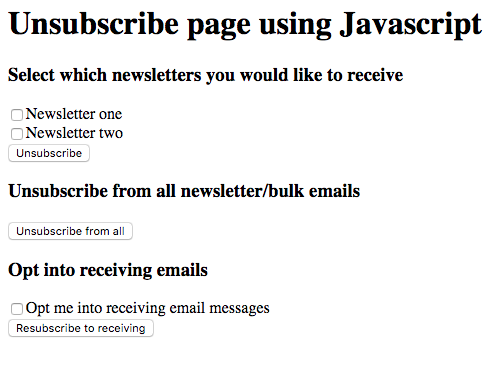

# Sample unsubscribe form

- To allow end user to control their [unsubscribe settings](https://docs.intercom.com/faqs-and-troubleshooting/unsubscribing-users/how-do-i-unsubscribe-users-from-receiving-emails)
- Lets them individually subscribe to individual newsletters
- Unsubscribe from all emails
- Resubscribe to emails