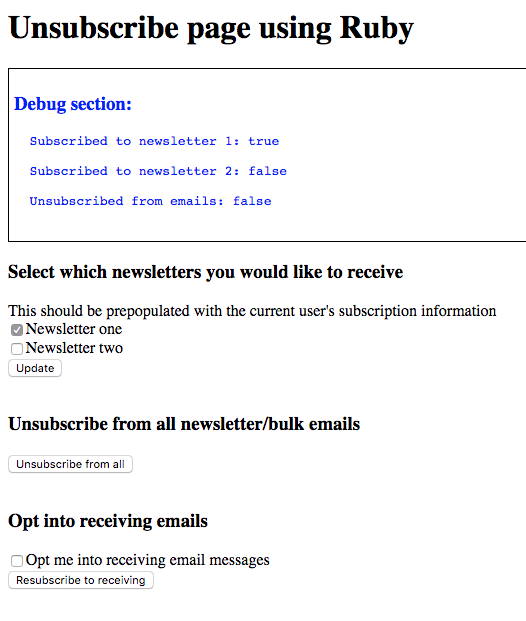

# Sample unsubscribe page in Ruby



## General guidelines when using the Intercom API with Ruby
- https://github.com/thewheat/intercom-testing-api/tree/master/ruby

## Install dependencies
`bundle install`

## Create `.env` file with your configuration

```
TOKEN="Your access token (standard access token is sufficient) https://developers.intercom.com/reference#personal-access-tokens-1"
```

## Modify app.rb to your app logic

### Way to identify user
```
user_id: @current_user[:user_id]
```

- Current implementation uses `user_id` to identify user https://docs.intercom.com/faqs-and-troubleshooting/your-users-and-leads-data-in-intercom/what-is-user-id
- If you wish to use `email`, change code to look up record by email instead

### Retrieving identifier of user
```
def get_current_logged_in_user
  @current_user = {user_id: "13"}
end
```

- Should be replaced with app logic to retreive the details of the currently logged in user

### Modify HTML fields
```
"newsletter1" => (params["newsletter1"] == "on"),
"newsletter2" => (params["newsletter2"] == "on")
```

```
<div><label><input type="checkbox" name="newsletter1" <%= (@user.custom_attributes["newsletter1"] ? "checked" : "") %> >Newsletter one</label></div>
<div><label><input type="checkbox" name="newsletter2" <%= (@user.custom_attributes["newsletter2"] ? "checked" : "") %> >Newsletter two</label></div>
```

- These should be changed to attributes in your Intercom app and text of actual names of newsletters in your app


## Run app
`ruby app.rb`

## Run app while development and auto reload on changes
`rerun ruby app.rb`